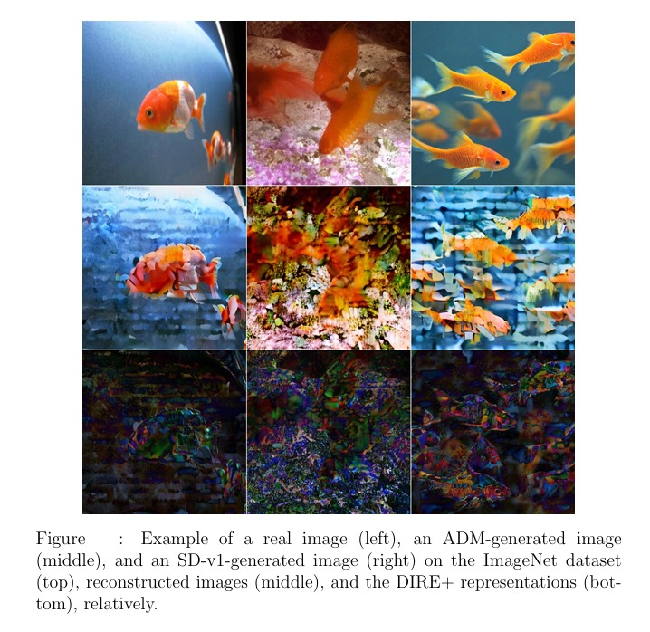

# Improving DIRE, an Approach to Detecting Diffusion Generated Images, for Better Robustness


## Abstract
> The rapid advancement of diffusion models and the increasingly realistic images they generate underscore the urgent need for effective fake image detection to prevent potential fraudulent activities. In response, Diffusion Reconstruction Error (DIRE) was proposed previously as an image representation technique designed for detecting images generated through diffusion processes. While DIRE demonstrates effectiveness in identifying images generated by diffusion generators unknown to it, it does not seem to generalize well to unseen datasets. To enhance its robustness to diverse datasets, this study proposes several modifications to the training approach of DIRE for synthetic image detection. These adjustments involve using a more varied dataset during training, integrating the state-of-the-art Masked Diffusion Transformer (MDT) model into the process of DIRE computations, and adapting the MDT architecture to better align with image reversal and reconstruction tasks of DIRE. The resulting iteration, called DIRE+, achieves notable improvements in prediction accuracy and precision scores on previously unseen datasets, while retaining its ability to generalize to unfamiliar diffusion generators.

I did not provide my model checkpoints, but for any questions feel free to contact: topuz.ilayda@outlook.com

<p align="center">

</p>

## Requirements
```
conda create -n dire python=3.9
conda activate dire
pip install torch==2.0.0+cu117 torchvision==0.15.1+cu117 -f https://download.pytorch.org/whl/torch_stable.html
pip install -r requirements.txt
```

## Training MDT_noclass
To train MDT without class conditioning, you need to first download a dataset. For example for ImageNet, create folders ImageNet/train_images, ImageNet/val_images, and ImageNet/test_images. Then, simply run the following command to train the model:
```
sh run.sh
```
Note that this model was trained solely for DIRE image reconstruction purposes and it does not serve for novel image generation.

## Training DIRE Classifier
Before training DIRE classifier, you should copy the checkpoint of MDT_noclass model (named `model290000.pt` in the codes) to the folder DIRE_plus and run the following command for train/val/test images to use the new MDT_noclass model during DIRE computations:
```
sh compute_dire.sh
```
Don't forget to modify MODEL_PATH according to yours. Then, link the resulting training DIRE images to the `data/train` folder. For example, you can link the DIRE images of real LSUN-Bedroom to `data/train/lsun/0_real` and link the DIRE images of ADM-LSUN-Bedroom to `data/train/lsun/1_fake_adm`. And do the same for validation set and testing set, just modify `data/train` to `data/val` and `data/test`. Then, you can train the DIRE classification model by running the following command:
```
sh train.sh
```
## Evaluation
You can evaluate your DIRE classification model by running the following command:
```
sh test.sh
```
## Inference
You can run the following command to inference a single image or a folder of images:
```
python demo.py -f [image_path/image_dir] -m [model_path]
```

## Acknowledgments
These codes are modified version of the combination of [DIRE](https://github.com/ZhendongWang6/DIRE) and [MDT](https://github.com/sail-sg/MDT). Thanks!
